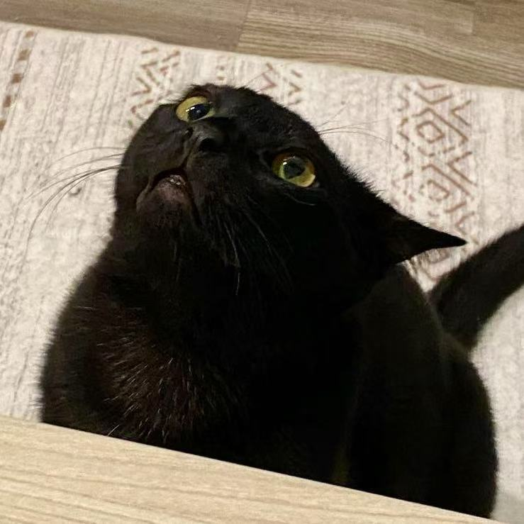

---
hide:
  - toc
  - navigation
---

# timyuan.devs

Hey! I'm <strong>Tim Yuan</strong>. 👋

Welcome to my personal website and portfolio.

I'm a computer science student passionate about **AI and web development**. 🎓

Currently pursuing my Master's at UIUC, I previously worked as a research intern at UC Irvine on 
**<a href="https://github.com/Texera/texera" target="_blank">Texera</a>** and **<a href="https://github.com/waynebhayes/CellUniverse" target="_blank">CellUniverse</a>**. 🔬

I'm currently working on an AI supported email client called **<a href="https://github.com/YS0meone/mailmind" target="_blank">MailMind</a>**. Check this out 🚀

